# Gymnasiam_Stream-Processing-in-Azure-Databricks-Lakehouse-following-Medallion-Architecture
To generate BPM Workout Summary and Gym Summary of the registered users for a Wearable Device Manufacturing Company.

## High Level Requirements:
- Design and Implement a Secure Lakehouse Platform using Medallion Architecture for a dev environment,
- Collect and ingest data from the source system to lakehouse platform.
- Decouple data ingestion from data processing
- Support Batch and Streaming Worklows
- Prepare following analysis datasets for the data consumers
  1. Workout BPM Summary
  2. GYM Summary
- Perform Integration Testing and automate it
- Automate deployment pipeline for development environment.

## Project Scope : Data Schema
### 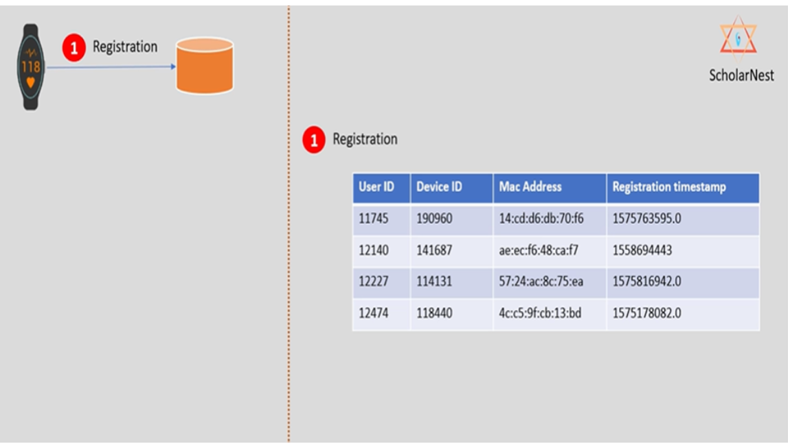
### 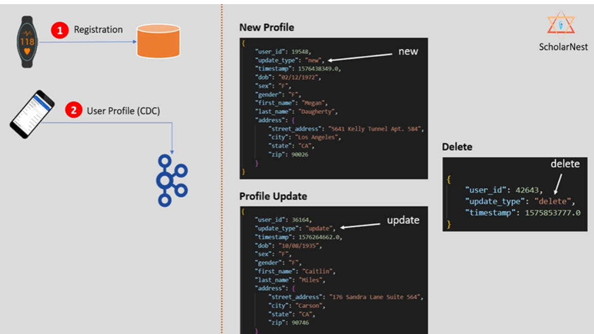
### 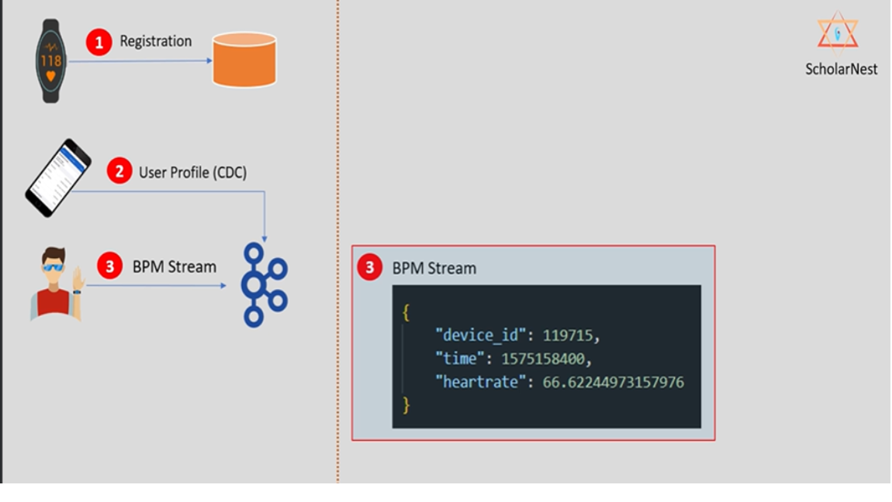
### 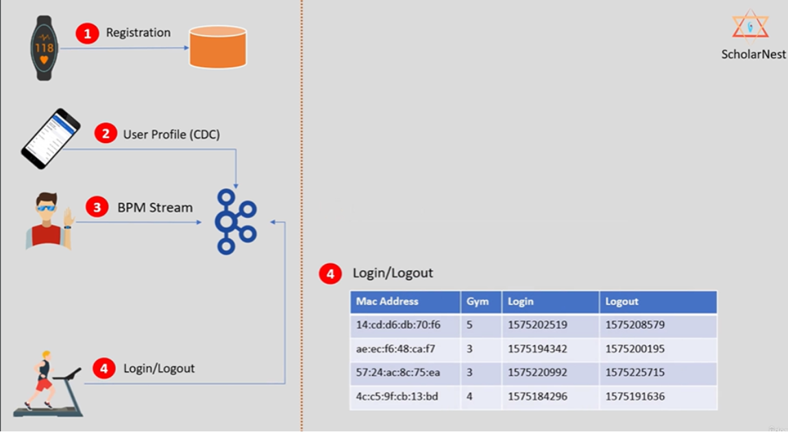
### 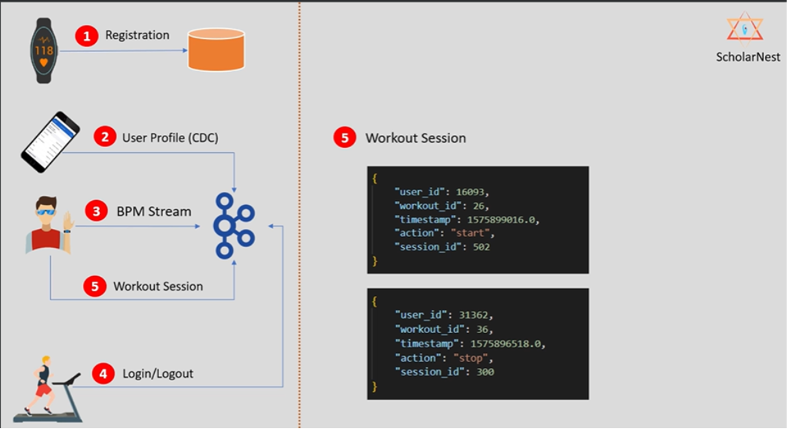
### 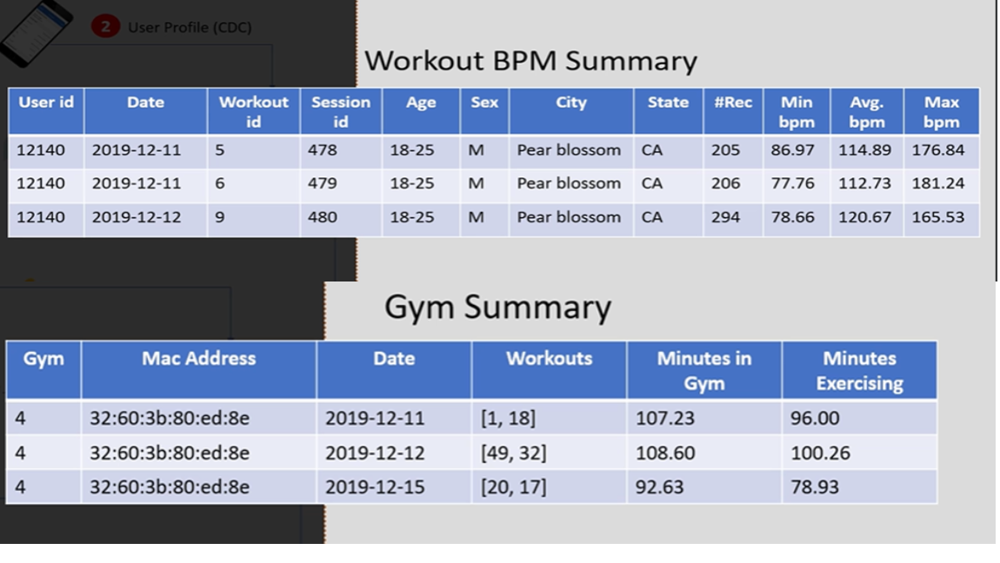

## Storage Design
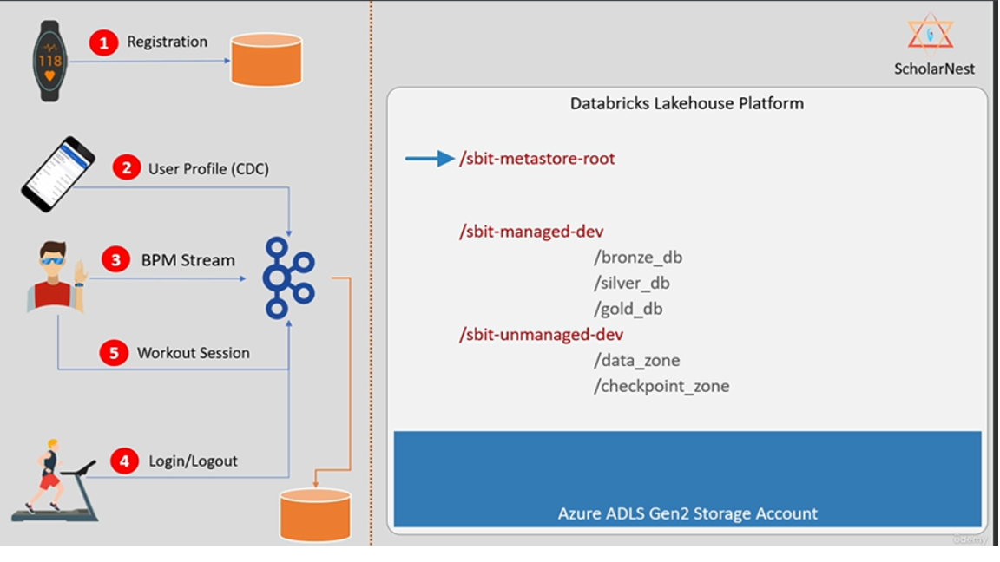

## Security Design
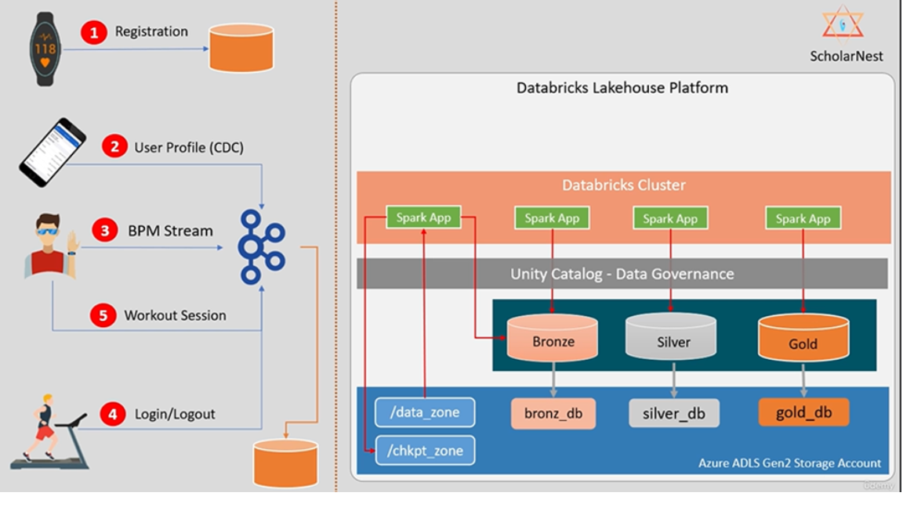

## Resource Policies:
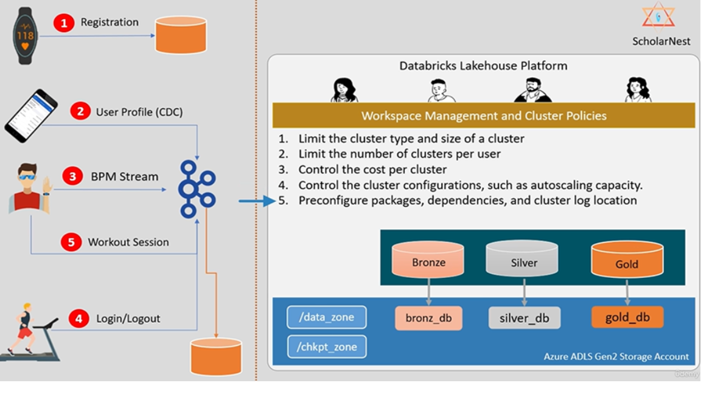

## Steps Done in Azure Portal to Implement Lakehouse:
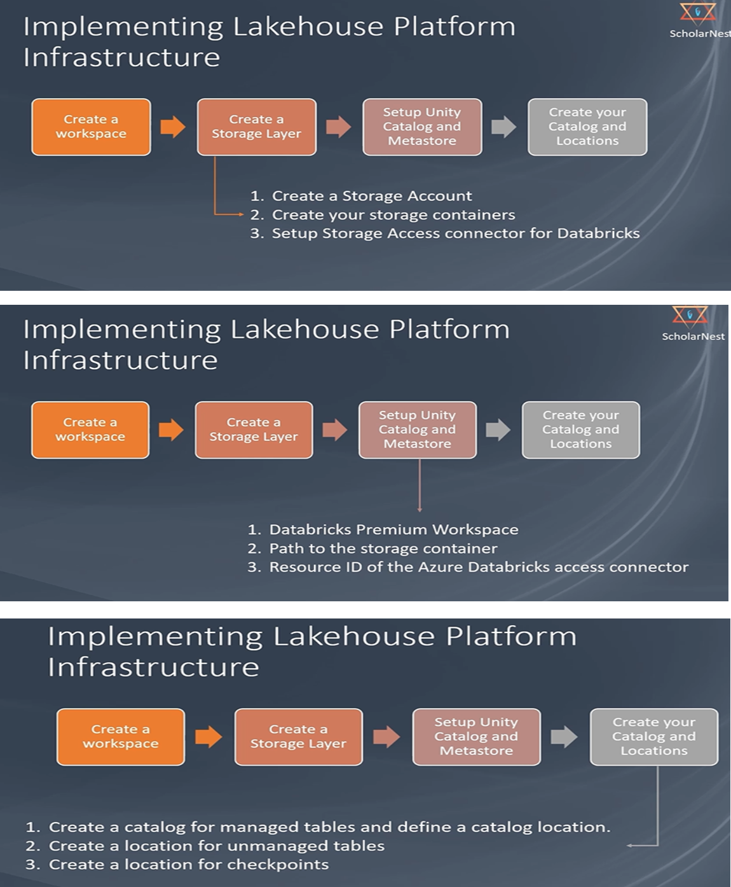

## Medallion Architecture:
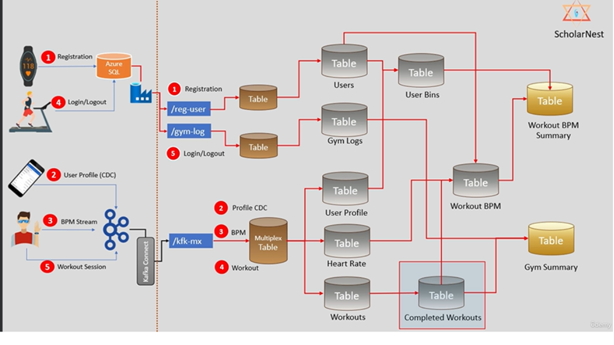

# Tech Stack:
- Storage: Azure Storage (ADLS Gen2)
- Compute: Azure Databricks
- Language: Pyspark (python 3.10)
- CI/CD: Azure Devops
