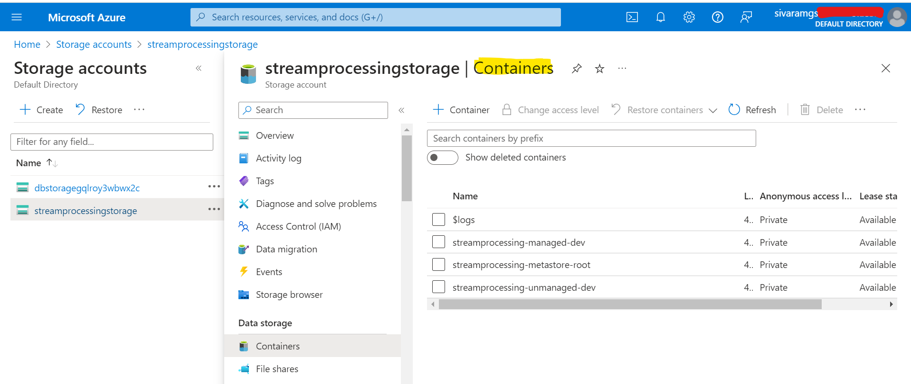
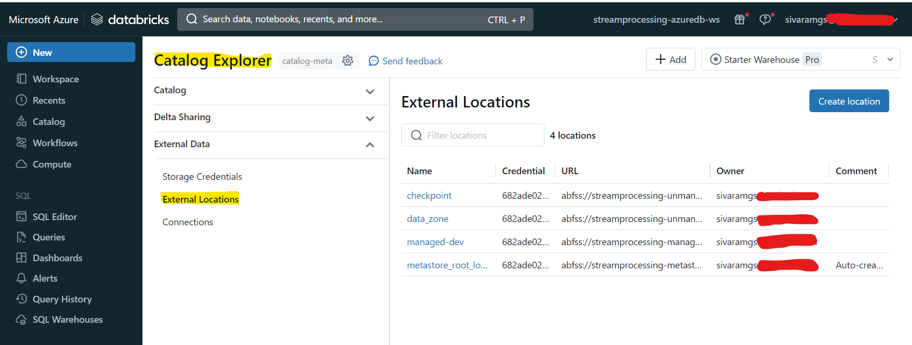
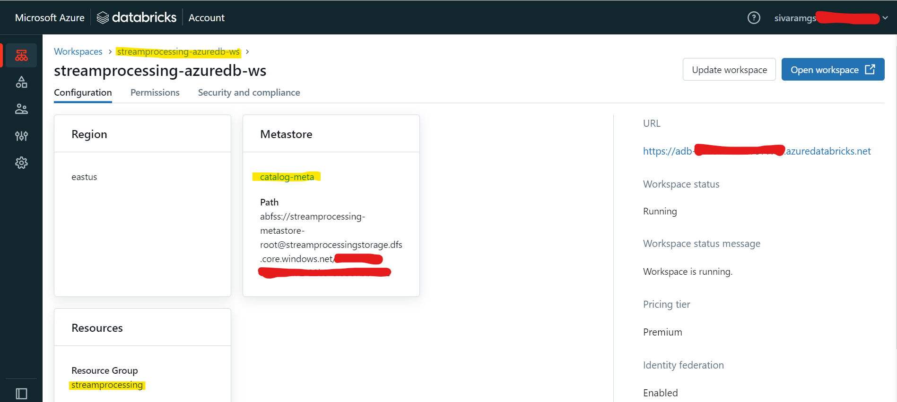
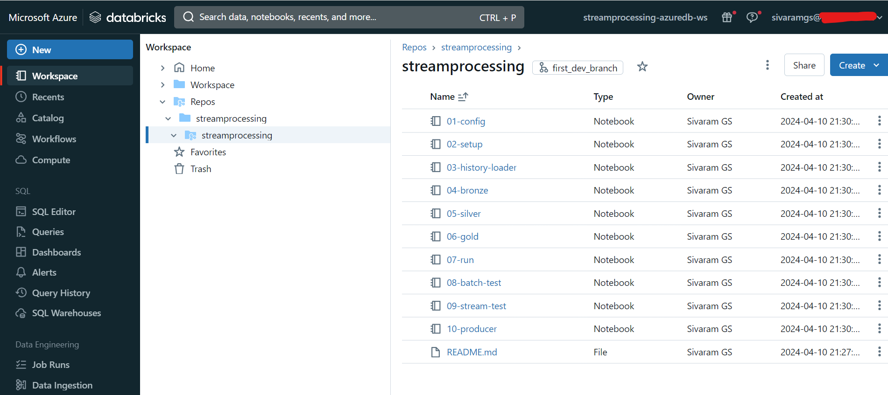
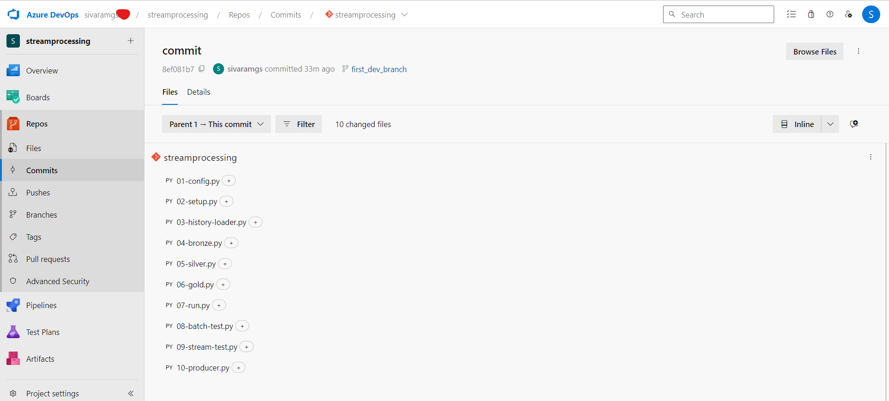

# Project
To generate BPM Workout Summary and Gym Summary of the registered users for a Wearable Device Manufacturing Company.

## High Level Requirements:
- Collect and ingest data from the source system to lakehouse platform.
- Design and Implement a Secure Lakehouse Platform using Medallion Architecture for a dev environment,
- Prepare following analysis datasets for the data consumers
  1. Workout BPM Summary
  2. GYM Summary

## Data Schema
### 
### 
### 
### 
### 
### 

# Tech Stack:
- Storage: Azure Storage (ADLS Gen2)
- Compute: Azure Databricks
- Language: Pyspark (python 3.10)
- CI/CD: Azure Devops

# Designs:
## Storage Design

## Security Design

## Resource Policies:

## Steps to Implement in Azure Databricks Lakehouse:

## Medallion Architecture: Tables Created in Databricks

# Work Done
- Created storage containers in ADLS Gen2 to store metadata, managed and unmanaged tables.
  
  
- Supported Batch and Streaming Workflows to ingest data from source system to lakehouse.
- Designed and Implemented a Secure Lakehouse Platform With Unity Catalog.
  
  
- Implemented Medallion Architecture by creating bronze, silver and gold layer tables.
  
- Automated Integration testing to check the process.
- Automated deployment pipeline for development environment in Azure Devops.
  
